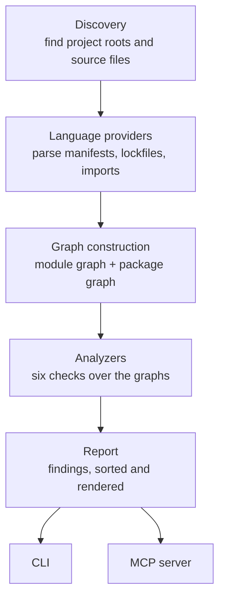

# 01 — Architecture

## Layers

Data flows in one direction. No layer calls back into a layer above it.



**Discovery** walks the tree, respecting `.gitignore`, and locates *project roots* — a directory
containing a recognized manifest. One repository may contain many (a monorepo, or a polyglot service
with a `package.json` frontend and a `pyproject.toml` backend). Each root is analyzed independently
and reported separately; a workspace/monorepo may additionally be analyzed as a unit
(see [07-open-questions.md](07-open-questions.md)).

**Language providers** turn files into facts. Given a project root, a provider yields declared
dependencies, resolved dependencies, and the imports found in each source file. Providers are the
only layer that knows about a specific language or package manager. See
[03-language-providers.md](03-language-providers.md).

**Graph construction** assembles two distinct graphs from those facts. These are separate structures
answering separate questions and are never merged. See [02-data-model.md](02-data-model.md).

**Analyzers** are pure functions over the graphs. Each declares what it needs; if that input is
absent the analyzer reports *unavailable* instead of running. Analyzers do not perform I/O — this is
what makes them cheap to unit-test against hand-built graphs.

**Report** collects findings, sorts them into a stable order, and hands them to a renderer.

## Crate layout

A Cargo workspace. The split exists to make the dependency direction structural rather than a matter
of discipline — `gdep-core` cannot accidentally depend on `clap`, because it doesn't have it.

```
crates/
  gdep-core/     # data model, discovery, LanguageProvider trait, graphs, analyzers, report types
  gdep-lang/     # the ten LanguageProvider implementations + registry
  gdep-cli/      # clap front-end, human and JSON renderers          -> binary `gdep`
  gdep-mcp/      # MCP server exposing the same analysis             -> binary `gdep-mcp`
```

`gdep-core` depends on nothing above it. `gdep-lang` depends on `gdep-core` for the shared types.
Both binaries depend on both libraries and on each other for nothing.

**The `LanguageProvider` trait lives in `gdep-core`, not `gdep-lang`.** An earlier draft put it with
the implementations, which does not work: analyzers live in core and need the trait — the
version-conflict analyzer calls `version_ops()` to compare versions per ecosystem, and discovery
needs `manifest_names()`. Core defines the abstraction, `gdep-lang` supplies the implementations,
and the binaries wire the two together.

Whether the ten language implementations stay in one crate or split into `gdep-lang-rust` and
friends is deferred until we see compile times; the trait boundary makes that split mechanical later.
Start with one crate and feature-gate per language so a consumer can build a smaller binary.

## Pipeline execution

1. **Walk** the tree once, collecting candidate files. Single-threaded, cheap, bounded by inode
   count. Use a walker that understands `.gitignore` so vendored trees and `node_modules` are
   excluded by default.
2. **Group** files by project root and language.
3. **Parse** manifests and lockfiles — one per project root, small, fast.
4. **Extract imports** — this is the expensive stage, one unit of work per source file, run in
   parallel. Each file is parsed independently; there is no shared mutable state.
5. **Build** graphs per project root.
6. **Analyze** — each analyzer runs over the finished graphs. Cheap relative to parsing; parallelize
   across project roots rather than across analyzers.
7. **Render**.

Stages 4 and 6 are where wall-clock goes. Everything is embarrassingly parallel at the file level,
so use a work-stealing pool rather than hand-rolled threading.

## Caching

Not in the first version, but the design must not preclude it. Import extraction is a pure function
of file contents, which means results are content-addressable: key a cache on the hash of the file
plus the provider version. Keep the extraction interface free of ambient state so this stays
possible. Do not build the cache until a real repository proves it is needed.

## Error handling

Three distinct outcomes, and conflating them is the most likely early design mistake:

- **Fatal** — gdep cannot run at all (path does not exist, no read permission). Abort with a
  diagnostic.
- **Project-level failure** — one project root cannot be analyzed (unparseable manifest). Record it,
  report it in the output, continue with the others.
- **Check-level unavailability** — an analyzer's required input is missing (no lockfile). Report the
  check as unavailable with the reason. This is a normal outcome, not an error.

A malformed source file falls under project-level: log which file and why, skip it, and include the
skip count in the report so nobody reads a clean result that silently omitted half the tree.

## Dependencies

Verified against crates.io and recorded in [08-crates.md](08-crates.md), along with the ones
deliberately deferred and the two ecosystem gaps (YAML, Python version parsing) that have no good
answer yet.
